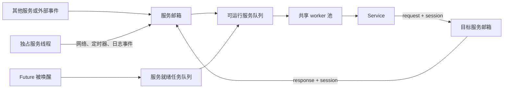

# rskynet

vibe coding 玩具项目，所有代码，包括当前文档均 ai 生成。

rskynet 是一个受 [skynet](https://github.com/cloudwu/skynet) 启发、使用 Rust 编写的 Actor 运行时。它保留了 skynet 的服务、邮箱、地址和 session 通信模型，并用 Rust `Future` 表达服务内异步流程，不依赖 Lua 运行时。

项目当前要求 Rust 1.85 或更高版本，使用 Rust 2024 edition。

## 核心特性

- 每个服务拥有独立地址和邮箱；同一服务在任意时刻只会由一条线程执行。
- 共享服务运行在工作窃取线程池上，服务状态可使用 `SvcCell`，无需为普通访问加锁。
- `request` / `reply` 通过 session 配对应答，调用方可直接 `.await`。
- 一个服务内可用 `ctx.spawn` 并发执行多个任务，`ctx.sleep_ms`、RPC 回包和外部唤醒统一进入调度器。
- 支持独占线程服务，适合定时器、日志和基于 `mio` 的网络轮询。
- 可选 TCP/UDP、TLS、QUIC、HTTP/1.1、WebSocket、Dashboard 和 Protobuf 跨节点通信。
- TOML 驱动启动流程；具名服务和集群 handler 可在链接期自动注册。
- 支持优雅关停、崩溃报告、服务运行统计和疑似死循环检测。

## 快速运行

克隆仓库后，可直接运行内置示例：

```bash
cargo run -p rskynet-examples -- config/examples/ping_pong.toml
```

这个示例会启动 `pong` 和 `ping` 两个服务，演示：

- `ctx.request(...).await` 的请求/应答；
- `ctx.spawn(...)` 发起服务内并发任务；
- `ctx.sleep_ms(...)` 通过时间轮休眠；
- 服务主动退出与节点自动结束。

其他示例：

| 示例 | 命令 | 说明 |
| --- | --- | --- |
| TCP echo | `cargo run -p rskynet-examples -- config/examples/echo_server.toml` | 监听 `127.0.0.1:8888`，原样返回收到的数据 |
| QUIC | `cargo run -p rskynet-examples -- config/examples/quic.toml` | 用自签名证书完成一次 QUIC stream 回显后退出 |
| HTTP | `cargo run -p rskynet-examples -- config/examples/http.toml` | 在随机本地端口完成一次 HTTP POST 回显后退出 |
| WebSocket | `cargo run -p rskynet-examples -- config/examples/websocket.toml` | 完成一次 WebSocket 文本回显后退出 |
| Dashboard | `cargo run -p rskynet-examples -- config/examples/dashboard.toml` | 在 `http://127.0.0.1:8080/` 展示节点状态 |

TCP echo 和 Dashboard 会持续运行，可按 `Ctrl+C` 关停。

### 跨节点示例

先在一个终端启动 node 2：

```bash
cargo run -p rskynet-examples -- config/examples/cluster_pong.toml
```

再在另一个终端启动 node 1：

```bash
cargo run -p rskynet-examples -- config/examples/cluster_ping.toml
```

node 1 会向 node 2 完成 10 次 Protobuf ping/pong，并请求两个节点退出。

## 编写服务

通常只需依赖门面 crate `rskynet`。从仓库路径开发时可这样配置：

```toml
[dependencies]
rskynet = { path = "path/to/rskynet/crates/rskynet" }
```

定义一个具名服务：

```rust
use rskynet::{Ctx, Error, MsgType, Result};

#[derive(Default)]
struct Echo;

#[rskynet::service(name = "echo")]
impl Echo {
    async fn init(&self, ctx: Ctx) -> Result<()> {
        if !ctx.register_name("echo") {
            return Err(Error::service("名字 .echo 已被占用"));
        }
        ctx.log("echo 已启动");
        Ok(())
    }

    #[msg(MsgType::USER)]
    async fn echo(&self, _ctx: Ctx, text: String) -> String {
        text
    }
}

fn main() -> std::process::ExitCode {
    rskynet::main::run()
}
```

`name = "echo"` 会把服务构造函数提交到链接期注册表。标准入口 `rskynet::main::run()` 会读取唯一的命令行参数作为 TOML 路径，再通过 `Registry::from_auto()` 收集当前二进制中所有具名服务。

对应配置：

```toml
thread = 4
profile = true

[bootstrap]
services = [
    { name = "echo" },
]
```

运行：

```bash
cargo run -- path/to/config.toml
```

不使用标准入口时，也可以显式构造注册表和配置：

```rust
use rskynet::{Config, ConfigExt, Registry, Result};

fn run() -> Result<()> {
    let registry = Registry::new().with("echo", Echo::default);
    let config = Config::default().with_bootstrap(["echo"]);
    rskynet::start(config, registry)
}
```

## 消息与并发

常用操作如下：

```rust,ignore
// 单向投递 USER 消息
ctx.post(".worker", rskynet::Payload::text("job"))?;

// 请求并等待 RESPONSE / ERROR
let reply = ctx
    .request(".worker", rskynet::Payload::text("question"))
    .await?;

// 在当前服务内启动并发任务
let task_ctx = ctx.clone();
ctx.spawn(async move {
    task_ctx.sleep_ms(100).await;
    task_ctx.log("done");
});
```

服务宏支持两种分发方式：

- 实现 `async fn dispatch(&self, ctx: Ctx, msg: Message)`，自行解析整条消息；
- 给方法添加 `#[msg(MsgType::...)]`，由宏按协议号解析负载并自动回复返回值。

同一协议号承载枚举消息时，可继续按 variant 拆分回调：

```rust,ignore
#[msg(MsgType::USER, variant = UserMessage::Notify)]
async fn notify(&self, ctx: Ctx, request: Notify) {}

#[msg(MsgType::USER, variant = UserMessage::Query)]
async fn query(&self, ctx: Ctx, request: Query) -> QueryResult { /* ... */ }
```

首版直接支持单位 variant 和 `Variant(T)`；复杂字段先包装成 struct。无返回值的
variant 只接受 send，带返回值的 variant 同时接受 send 与 call。发送端传递完整的
外层枚举，并为它声明 `boxed_payload!(UserMessage)`。

自定义对象负载可用 `rskynet::boxed_payload!(Type)` 接入 `FromPayload` / `IntoPayload`。需要专用线程时使用 `#[rskynet::exclusive]`，并按需实现同步的 `idle` 和 `interrupt` 钩子。

## 配置与启动顺序

顶层只有两个内核配置项：

```toml
# 共享 worker 数；默认取系统可用并行度，必须大于 0
thread = 4

# 是否记录服务消息数与处理耗时；默认 true
profile = true
```

其余扩展配置必须写成 TOML section。每个服务通过 `ctx.node().section::<T>("name")` 读取自己的 section；顶层出现未知的普通键会被视为配置错误。

默认 feature 下，节点依次启动 logger、signal、timer 和 bootstrap。可选基础设施由配置段触发，并在 bootstrap 业务服务之前按依赖顺序启动：

```text
net -> tls -> quic -> http-client -> cluster -> dashboard -> bootstrap services
```

仅会启动实际需要的项。例如存在 `[quic]` 时会自动先启动 `net`；存在 `[dashboard]` 时会自动启动 Dashboard、HTTP 所需的网络层。不要再把 `net`、`tls`、`quic`、`http-client`、`cluster` 或 `dashboard` 手工写入 `[bootstrap].services`。

完整配置示例见 [config/dev.toml](config/dev.toml) 和 [config/examples](config/examples)。

## Cargo features

`rskynet` 的默认 features 为 `macros`、`logger`、`timer`、`bootstrap`、`signal` 和 `main`。

| Feature | 能力 | 自动包含 |
| --- | --- | --- |
| `macros` | `service`、`exclusive`、`msg`、`signal` 过程宏 | 默认启用 |
| `logger` | 独占线程日志服务 | 默认启用 |
| `timer` | 分层时间轮和定时器服务 | 默认启用 |
| `bootstrap` | 按 TOML 清单顺序启动业务服务 | 默认启用 |
| `signal` | 信号处理、优雅关停和崩溃报告 | 默认启用 |
| `main` | 标准 TOML 命令行入口 | 默认启用 |
| `net` | TCP/UDP socket 服务 | — |
| `tls` | 基于 rustls 的 TLS 服务 | `net` |
| `quic` | 基于 quinn-proto 的通用 QUIC stream/datagram 服务 | `net` |
| `http` | HTTP/1.1 客户端与可嵌入服务端 | `net` |
| `https` | HTTPS 客户端和 TLS 服务端传输 | `http`、`tls` |
| `websocket` | WebSocket 客户端及服务端升级 | `http` |
| `dashboard` | 节点统计 API 和内嵌 Web UI | `http` |
| `cluster` | Protobuf 跨节点通信 | `net`、`bootstrap` |

`quic` 提供标准 QUIC 连接、双向/单向 stream 和可选 datagram，业务双方需约定
相同的 ALPN 与报文 framing。它不是 HTTP/3 或 WebTransport，浏览器 JavaScript 不能
直接使用；首版 listener 还必须绑定明确 IP，不接受 `0.0.0.0` / `::` wildcard。

例如：

```toml
[dependencies]
rskynet = {
    path = "path/to/rskynet/crates/rskynet",
    features = ["https", "websocket", "dashboard", "cluster", "quic"]
}
```

如果关闭默认 features，必须自行提供被移除部分的职责。尤其是没有 `timer` 时，需通过 `Builder` 注入一个 `Timer` 实现；没有 `bootstrap` 时，需自行安排首个业务服务的启动。

## Workspace 组成

| Crate | 职责 |
| --- | --- |
| `rskynet` | 门面 crate、feature 组合、标准入口和自动基础设施启动 |
| `rskynet-core` | Actor 内核、邮箱、调度器、Future 任务、session、配置与生命周期 |
| `rskynet-macros` | 服务、独占服务、消息、信号和集群过程宏 |
| `rskynet-bootstrap` | 按配置清单顺序启动业务服务 |
| `rskynet-logger` | 独占线程日志写入 |
| `rskynet-timer` | 10 ms 分层时间轮及定时器服务 |
| `rskynet-signal` | 进程信号、优雅关停、崩溃日志和 minidump |
| `rskynet-net` | 基于 `mio` 的 TCP/UDP 网络服务 |
| `rskynet-tls` | 基于 `rustls`、运行于 `rskynet-net` 之上的 TLS 服务 |
| `rskynet-quic` | 基于 `quinn-proto`、运行于 `rskynet-net` UDP 之上的通用 QUIC 服务 |
| `rskynet-http` | HTTP/1.1 客户端、服务端驱动和可选 WebSocket |
| `rskynet-dashboard` | 节点及 socket 统计 API、内嵌 Dashboard |

Dashboard 的消息页会展示显式开放的强类型消息。业务消息类型使用
`#[derive(rskynet::MessageSchema)]`，并在 `#[msg(...)]` 处理器上添加 `#[debug]` 或
`#[debug(name = "...")]`；宏会直接从类型字段生成请求与响应 schema，不需要
`Default` 或手写 example，`#[msg(default)]` 不会进入消息文档。

在线 send/call 默认关闭；需要时在 loopback 监听地址下配置 `debug_console = true`。
请求类型仍需支持 serde 反序列化，有返回值的 call 还要求返回类型支持 serde 序列化。
`debug_call_timeout_ms` 默认是 10000。
| `rskynet-cluster` | Prost 消息编码、节点连接和跨节点请求/应答 |

## 运行时模型



共享服务由 worker 池调度，空闲 worker 会从其他 worker 的运行队列窃取工作。邮箱和就绪任务共同决定一个服务是否可运行；调度器保证服务不会被并发执行。日志、定时器和网络服务使用独占线程，但仍通过普通地址、邮箱和消息参与节点生命周期。

## 开发与验证

```bash
# 全 workspace 测试
cargo test --workspace --all-features

# 静态检查
cargo clippy --workspace --all-targets --all-features

# 生成本地 API 文档
cargo doc --workspace --all-features --no-deps
```

workspace 的 dev/release profile 均使用 `panic = "abort"`。标准入口会在读取配置前安装崩溃处理器；如果编写自定义入口并启用了 `signal`，应首先调用 `rskynet::crash::install()`，并让返回的 guard 存活到进程结束。

## License

各 crate 的 Cargo manifest 声明为 MIT License。
