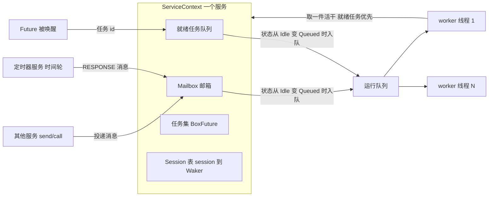
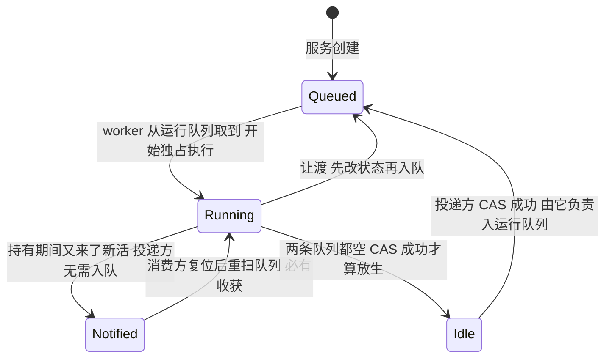
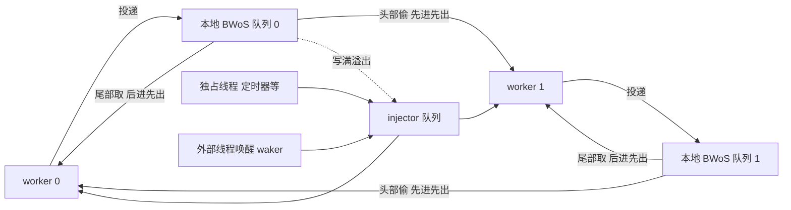

# rskynet

用 Rust 复刻 [skynet](https://github.com/cloudwu/skynet) 的 Actor 内核。**不需要 Lua**——skynet 用协程解决的问题，Rust 的 `async`/`Future` 原样能解，还多了编译期类型检查。

```rust
// 这段代码读起来是同步的，实际上挂起的只是当前这个任务，服务照常处理其它消息
let reply = ctx.request(".pong", Payload::of(Ask::Ball(round))).await?;
```

## skynet 的灵魂是哪三件事

| skynet 的做法 | rskynet 的做法 |
| --- | --- |
| **服务即 Actor**：每个服务有独立地址、独立邮箱，彼此只靠消息往来，内部天然单线程 | 一样。服务实现 `Service` trait，状态放进 `SvcCell`，全程不需要锁 |
| **两级消息队列**：每服务一个邮箱，全局一个「有活干的服务」队列，N 个 worker 线程从中取活 | 一样。`Mailbox` + 运行队列，邮箱状态机保证同一服务绝不被两个 worker 同时执行。区别是两级队列都不加锁，见下文 |
| **session 配对**：`call` 分配一个 session 并挂起协程，回包带同一 session 回来时唤醒它 | 一样，只是把协程换成 `Future`：`session -> Waker`，`call` 就是一句 `.await` |

第三点是关键：**Lua 协程只是实现手段，不是设计本身**。把它换成 `Future` 之后，`call`、`sleep`、`fork` 的语义一字不差，而且不再需要嵌一个脚本虚拟机。

## 调度模型

rskynet 在 skynet 的基础上做了一处推广：**服务的「可运行」条件从「邮箱非空」变成「邮箱非空 或 有就绪任务」**。于是定时器回包、RPC 回包、外部线程唤醒三者走的是同一条路径，邮箱那一个状态机就同时管住了消息与 Future 唤醒。



worker 的一轮调度（对照 C 版 `skynet_context_message_dispatch`）：

1. 从运行队列取一个服务，取不到就先自旋一会儿，还是空手才挂起
2. 反复 `take_work()`：优先 poll 就绪任务，其次取一条消息
   - 消息是 `RESPONSE`/`ERROR` 且带 session → 直接唤醒等待中的任务
   - 其它消息 → 开一个新任务跑 `dispatch`，等价于 skynet 新建一个协程
3. 每干满 64 件活（消息与就绪任务各算一件）就回头看一眼运行队列：确实有别人在等才让渡，把自己交回队列；没人等就重新计数接着跑
4. 邮箱和就绪队列都空了 → 状态落回 `Idle`，脱离运行队列，等下一次投递

「就绪任务优先于新消息」不是随便定的：它对应 skynet 里被 resume 的协程会一路跑到下一次 yield，之后才轮到下一条消息。

### 独占一条线程的服务

服务默认跑在共享的 worker 池上，也可以让它**独占一条线程**——这样的服务每 `launch` 一次就新起一条线程，那条线程只跑这一个服务，空闲时由服务自己决定怎么睡。日志、定时器、将来的网络层都是这一类。

C 版 skynet 为定时器与 socket 各写了一条专用线程：它们不是服务，没有邮箱也没有地址，内核得为它们单开一套代码。这里换个思路，把「独占一条线程」做成**服务的一种运行方式**（形态接近 ltask 的 exclusive service），于是那些活都由普通服务承担：

| | 共享服务 | 独占服务 |
| --- | --- | --- |
| 谁来执行 | 运行队列上的某个 worker，可能被窃取 | 自己那条线程，从不进运行队列 |
| 没活干时 | 去找别的服务干，找不到才挂起 | 调服务自己的 `idle` 钩子 |
| 有活投进来 | 邮箱入运行队列，按空闲位图点名叫一个 worker | `unpark` 那条线程，再调一次 `interrupt` |
| 适合什么 | 业务服务：`launch` 一万个只是一万个邮箱 | 要阻塞在自己事件源上（epoll）、或要按节拍醒来（时间轮）的活 |

两者共用同一个邮箱状态机与同一段取活逻辑（`Node::run_service`），`init` / `dispatch` 的写法一字不差。「同一服务任意时刻只在一条线程上执行」这条不变量在独占模式下只会更强，所以 `SvcCell` 照旧可用。

`Exclusive` 只有两个钩子：

- `idle(&self, ctx, idler)`：邮箱与就绪队列都空了时调用，跑在自己那条线程上，可以放心阻塞。默认实现是 `idler.park()`；定时器在这里推一格时间轮再 `park_timeout(2.5ms)`；网络层将来在这里 `poll.poll(events, None)`，顺手把 IO 事件转成消息投出去。
- `interrupt(&self)`：从任意线程把上面那个阻塞叫醒。默认空实现——内核每次唤醒都会**先 `unpark` 再调 `interrupt`**，所以纯消息驱动的服务（日志）什么都不用写；阻塞在别处的服务在这里敲自己那个唤醒手段（mio 的 `Waker`）。这里有一条硬要求：`interrupt` 必须接得住**早到的唤醒**——它可能发生在线程真正睡下去之前，那一下不能丢，否则「取活取空」与「睡下去」之间的那次投递就没人管了。`std` 的 park 令牌与 mio 的 `Waker` 都满足，`Condvar` 不满足。

退出时序上，独占线程的退出条件是**自己被摘除**而不是节点收工，这样日志服务「留到最后收尾」的语义原样保住：`start()` 收尾时先 `retire_all()` 送走普通服务、join 掉它们的线程，最后才摘除保留服务（日志与定时器）。而发现自己已死之后，那条线程会先把邮箱里积压的消息处理完再销毁——不然关停前最后几行日志就跟着清理一起丢了。

### 邮箱：无锁队列 + 四态状态机

C 版的邮箱是「一把锁 + 环形缓冲 + `in_global` 布尔量」，投递、取活、就绪任务全压在那一把锁上。这里换成两条无锁队列（`crossbeam` 的 `SegQueue`）加一个原子状态机。

状态机是必须的，不能只把布尔量改成 `AtomicBool`：**「队列已空」与「我要放生这个服务」这两件事必须原子地绑在一起**，否则会丢活——消费方看到两条队列都空 → 投递方压入新消息、看到标志仍为真于是不入队 → 消费方清掉标志放生。那条消息就此再也无人处理。C 版靠邮箱那把锁把两件事圈在一起，无锁化之后改用四个状态，把「持有期间来了新活」显式记下来：



三条纪律撑住了整套东西：

- **投递方先压队列、再改状态**。于是消费方一看到 `Notified`，复位重扫就一定捞得到东西，那个循环必然收敛。
- **入队方先改状态、再真的入队**（都收在 `Scheduler::push` 里）。反过来的话，别的 worker 可能已经把服务取走并置成 `Running`，那一记 `store` 就把它标成了「在队列里，实际谁也没拿着」，这个服务从此不会再被唤醒。
- **销毁流程的最后一步才放生**，而且只有确认清理期间没有新活进来才算成功。服务一旦放生就可能被别的 worker 重新领走、再清一次，而清理动的都是「只有持有者会碰」的结构，两个 worker 同时清一个服务是不行的。

### 运行队列：每 worker 一条，闲了去偷别人的

C 版的全局队列是一把大锁护着的环形缓冲，worker 越多争得越凶。这里换成 [BWoS 块式工作窃取队列](https://www.usenix.org/conference/atc23/presentation/wang-jiawei)（移植自 [stdexec](https://github.com/NVIDIA/stdexec) 的 `bwos_lifo_queue.hpp`）：每个 worker 一条自己的队列，在上面 push/pop 不需要任何锁，闲下来才去别人队列头部窃取。

BWoS 的巧劲在于把环形缓冲切成若干**块**：owner 只碰当前块的写指针，窃贼只碰更早那些已经「交出去」的块，两者常态下一次 CAS 都不用打照面，只有跨块的瞬间才同步一次，摊薄到每 16 个元素一次。



BWoS 的 owner 侧操作只允许绑定线程调用，可投递方却是任意线程——独占服务那几条线程、被外部 channel 唤醒的 waker 都算。所以还留了一条 injector 队列兜底（同样是 `SegQueue`，无锁）：非 worker 线程的投递、本地队列写满的溢出都落在这里，谁都能取。worker 每取 64 次活会回头看一眼 injector，免得里面的服务被本地队列饿死。

**本地队列是后进先出的**，这是 BWoS lifo 变体的定义，图的是刚投递的服务多半还热在缓存里。代价是让渡回去的服务下一轮很可能又被同一个 worker 取到，不再是 skynet 那种严格 FIFO 轮转；跨 worker 的公平由窃取（从队列头部取最老的）和 injector 兜底。

### 让渡：按争用情况决定，没有权重表

C 版给每个 worker 分了档：前 4 条线程一次只处理一条消息（响应快），后面的按 `队列长度 >> weight` 批处理（吞吐高）。**这张表这里没有照搬**，因为它的前提是那条全局 FIFO 队列——服务每次让渡后可能被任何一个 worker 取走，所以它在时间上体验到的是各档权重的平均值，那张表表达的是「整个池子里四分之一的线程偏延迟」这个赌注。

换成每 worker 一条本地队列之后前提就没了：投递在无人空闲时落进自己的队列，owner 侧又是后进先出，服务倾向和某个 worker 粘住。照搬的结果是两个一模一样的服务，落在 0 号的永远一条一条处理、落在 8 号的每次批处理一半积压，差别完全取决于它偶然落在了哪里。而线程数不满 32 时还只用表的前几项，`thread = 4` 就是四个 worker 全档 `-1`，等于整个节点没有批处理。

所以让渡改成一条统一规则：**干满 64 件活，问一次「运行队列里有人在等吗」，有就让渡，没有就接着跑。**

- 没人等的时候行为与「一口气干到邮箱空」完全一致，多付的只有每 64 件一次原子读。批量的意义本来也不在省下队列往返，而在于让一个服务在被换下之前把自己那几 KB 工作集（任务槽、session 表、future 状态机）用够
- 判断按批问而不是按件问，是因为记录排队总数的那个计数器被所有 worker 的每次 push/pop 反复写，是条热缓存行。而且「有人在等」只是个提示：别人本地队列当前块里的服务偷不动、handoff 槽里的只有那个 worker 拿得到，误判时这一趟找活白跑，批量正好给误判设了个摊薄系数
- **消息与就绪任务各算一件**。只数消息的话，一个在 poll 里唤醒自己再挂起的任务（`yield_now` 那类 future 就是这么写的）会让就绪队列永远非空、邮箱永远等不到空，那个 worker 从此看不到收工信号——而主线程正卡在 join 上、摘除服务排在 join 之后，于是节点再也关不掉
- 收工信号也算「该让渡了」，这是上面那种任务唯一的出口

独占服务不参与这套：它那条线程只有它一个服务，让渡给谁都没有意义，所以一次干到邮箱空。

### 唤醒：空闲位图 + 定向 unpark + handoff 槽

投递方想唤醒一个 worker，得先答出「有人在睡吗、叫谁、要不要叫」。队列一分散，「有没有新活」就不再是一次判断能问出来的，两边必须构成 Dekker 模式（各有一个全序点）才不会丢唤醒：

- **worker 侧先登记再扫**：`fetch_or` 把自己在空闲位图（每 64 个 worker 一个 `AtomicU64`）里的那一位置上，**然后**才去扫队列；扫到活就清位干活，扫不到才 `thread::park()`。park 自带 token，早到的 `unpark` 不会丢，所以不需要「睡前复查序列号」那一套。
- **投递侧先入队再看**：一记 `fence(SeqCst)` 之后读位图，非零就 CAS 清掉某一位、`unpark` 那个**具体**的 worker。比起原先每次投递都在共享行上做一次 `fetch_add` RMW，这里是本地 fence 加一次读多写少的普通读。

叫谁：**取位图最低位**。这等于稳定偏好编号小的那几个 worker，其余的长睡不受反复扰动——正是「worker 远多于负载」那个场景要的。缓存热度上「最近睡下的优先」（Treiber LIFO 栈）更好，但会把唤醒摊到所有线程上，与省唤醒的目标相反。

再叠两层节流：

- **`searching` 计数抑制无谓唤醒**：worker 醒来找活时 `+1`，拿到活或决定去睡时 `-1`。投递方只在 `searching == 0` 时才唤醒——已经有人醒着在扫队列，就让它顺手把这件活捞走。一条消息扇出几十次投递时，这一条把唤醒次数从 O(消息数) 压到 O(1)。代价是有人在找活时投递要走 injector（本地队列里正在写的那块对别人隐形），换来的是不叫第二个线程起来。
- **睡前先自旋**：找不到活不立刻 park，先做几轮轻量重扫。活是一阵一阵来的，这一条避免了「消息比我睡下晚了半微秒」就白付一次挂起+唤醒——Windows 上一次往返 1~10µs，正是那 1/6 吞吐的去处。

`handoff` 槽治的是另一个问题：唤醒了一个 worker，活该放哪儿？放本地队列它看不见（BWoS 里 owner 正在写的那一块对窃贼隐形），全走 injector 又等于放弃了本地路径。学 ltask 的 `service_ready`，每个 worker 一个单槽 `AtomicPtr`，投递方 CAS 占位、被唤醒者醒来先看自己的槽。于是服务能直接递到目标 worker 手上；槽已被占才退回 injector。

### 窃取：位图挑受害者，别扫全场

原先的窃取是「随机起点 + 环形扫完所有 worker」。22 核上一个空闲 worker 最坏要读 21 条别人的队列头，所有空闲 worker 同时这么干就是 O(N²) 的跨核缓存流量——偷不到的时候尤其亏，因为 BWoS 允许伪失败，「扫完一圈没偷到」根本不代表别人真闲着。

`Scheduler` 于是维护一张 `stealable` 位图，位 i 表示 i 号 worker 的本地队列**有已交出的整块可偷**。维护信号从 `bwos` 的返回值里透出来，而不是塞回调进去：`Owner::push_back` 告诉调用方「本次跨块了，前一块已交给窃贼」→ owner 置自己的位；窃贼偷空一条队列 → 清掉受害者的位。owner 侧每 16 个元素才更新一次位图，摊薄后可忽略；窃贼从此是「读一个字、挑一位」。

外加两道限流：并发窃取者数不超过 `max(1, worker 数 / 2)`（超了就直接去睡，tokio 的做法），单轮最多试几个受害者，失败就回退到「看 injector → 自旋 → park」，不再固执地扫满 N-1 个。

## 快速上手

```rust
use rskynet::{Config, ConfigExt, Ctx, Message, Registry, Result};

struct Echo;

#[rskynet::service]
impl Echo {
    async fn init(&self, ctx: Ctx) -> Result<()> {
        ctx.register_name("echo");
        Ok(())
    }

    async fn dispatch(&self, ctx: Ctx, mut msg: Message) {
        let payload = msg.take_payload();
        let _ = ctx.reply(&msg, payload);
    }
}

fn main() -> Result<()> {
    // 日志、定时器、引导这三个内置服务由 rskynet::start 按 feature 挂上
    let registry = Registry::new().with("echo", || Echo);
    let config = Config::default().with_bootstrap(["echo"]);
    rskynet::start(config, registry)
}
```

跑内置示例：

```bash
cargo run -p rskynet-examples -- config/examples/ping_pong.toml
```

它会演示三件事：`call` 的同步写法、`spawn` 的服务内并发、`sleep` 走定时器。输出大致是：

```
[     0.01] [:00000004] 1000 个来回耗时 12.03ms，平均单程 6.0µs
[     0.31] [:00000004] 三个请求（30/10/20 厘秒）的完成顺序是 ["睡10厘秒", "睡20厘秒", "睡30厘秒"]，总耗时 303ms
```

第二行是重点：三个请求分别要睡 300/100/200 毫秒，总耗时 303ms 而不是 600ms，说明它们在对端是**并发**处理的；完成顺序也按实际睡眠时长排列，而不是发出顺序。

## API 对照表

| skynet (Lua) | rskynet |
| --- | --- |
| `skynet.send(addr, type, ...)` | `ctx.send(addr, mtype, payload)` / `ctx.post(addr, payload)` |
| `skynet.call(addr, type, ...)` | `ctx.call(addr, mtype, payload).await` / `ctx.request(addr, payload).await` |
| `skynet.ret(...)` | `ctx.reply(&msg, payload)` |
| `skynet.fork(f)` | `ctx.spawn(future)` |
| `skynet.sleep(ti)` | `ctx.sleep(ticks).await` / `ctx.sleep_ms(ms).await` |
| `skynet.newservice(name)` | `ctx.launch(kind, args).await` |
| `skynet.register(".name")` | `ctx.register_name("name")` |
| `skynet.localname(".name")` | `ctx.query_name("name")` |
| `skynet.exit()` / `skynet.kill(addr)` | `ctx.exit()` / `ctx.kill(addr)` |
| `skynet.abort()` | `ctx.abort()` |
| `skynet.now()` / `skynet.time()` | `ctx.now()` / `ctx.time()` |
| `skynet.error(...)` | `ctx.log(...)` / `rskynet::log!(ctx, "...")` |
| `skynet.stat("mqlen"/"message"/"cpu")` | `ctx.mailbox_len()` / `ctx.message_count()` / `ctx.cpu_cost()` |
| `socket.listen(addr, port)` / `socket.start(id)` | `net::listen(&ctx, addr).await` / `net::start(&ctx, id).await` |
| `socket.open(addr, port)` | `net::connect(&ctx, addr).await` |
| `socket.write(id, data)` / `socket.lwrite(id, data)` | `net::send(&ctx, id, data)` / `net::send_low(&ctx, id, data)` |
| `socket.close(id)` / `socket.shutdown(id)` | `net::close(&ctx, id).await` / `net::shutdown(&ctx, id)` |
| `socket.udp(...)` / `socket.sendto(...)` | `net::udp(&ctx, bind).await` / `net::udp_send(&ctx, id, to, data)` |

寻址方式也照搬：`":0100000a"` 是十六进制 handle，`".name"` 是本地名字，直接传 `u32` 则是 handle。

## 过程宏与网络层

默认启用的 `#[service]` / `#[exclusive]` 会生成对应 trait 实现；`#[msg]` 按协议号
路由，并通过 `FromPayload` 取参数。有返回值且发送方在等待时会自动回包，自定义对象
用 `boxed_payload!(Ask, Answer)` 声明负载转换：

```rust
#[rskynet::service]
impl Calculator {
    async fn init(&self, ctx: Ctx) -> Result<()> {
        ctx.register_name("calculator");
        Ok(())
    }

    #[msg(MsgType::USER)]
    async fn add(&self, ask: Add) -> Sum { Sum(ask.0 + ask.1) }

    #[msg(default)]
    async fn other(&self, _ctx: Ctx, _msg: Message) {}
}
```

网络层用 `net` feature 打开。它只注册服务类型，不会自动拉起；在 `[bootstrap]`
清单中先启动 `net`，业务服务再调用 `listen` / `connect` / `start` / `send`，并用
`#[msg(MsgType::SOCKET)]` 接收 `SocketEvent`。可直接运行
`cargo run -p rskynet-examples -- config/examples/echo_server.toml`，再用
`telnet 127.0.0.1 8888` 验证回声。

## 源码对照

模块名刻意与 `skynet-src` 的文件名对齐，方便逐一比对：

| rskynet | skynet | 内容 |
| --- | --- | --- |
| `message.rs` | `skynet_mq.h` | `Message` / `MsgType`（数值与 `PTYPE_*` 一致）/ `Payload` |
| `mq.rs` | `skynet_mq.c` | 每服务邮箱与四态状态机、运行队列（每 worker 一条 + injector）、唤醒与窃取、过载检测 |
| `bwos.rs` | 无对应 | BWoS 块式工作窃取队列，移植自 stdexec 的 `bwos_lifo_queue.hpp` |
| `handle.rs` | `skynet_handle.c` | handle 分配（harbor 占高 8 位）、槽位倍增、本地名字表 |
| `server.rs` | `skynet_server.c` | `ServiceContext`、`Node`、消息分发主循环、服务生命周期 |
| `clock.rs` | 无对应 | `Timer` 抽象：内核只认它，实现由启动方注入 |
| `module.rs` | `skynet_module.c` | 服务类型注册表（静态注册取代 `dlopen`） |
| `start.rs` | `skynet_start.c` | 配置、线程池、引导、退出 |
| `context.rs` | `lualib/skynet.lua` | 用户侧 API：`call` / `send` / `fork` / `sleep` |
| `session.rs` | `lualib/skynet.lua` | `session_id_coroutine` 的对应物 |
| `task.rs` | Lua 协程池 | 服务内 executor、`SvcCell` |
| `exclusive.rs` | 无对应 | 独占线程的服务：`Exclusive` 的 `idle` / `interrupt` 两个钩子与那条线程的主循环，见上文 |
| `ext.rs` | 无对应 | 内核对外的扩展接口：`NodeRef` / `ReplyToken`，见下文 |

内置服务一个都不在内核里，各是一个独立 crate（见下文「内核里为什么没有服务」）：

| rskynet | skynet | 内容 |
| --- | --- | --- |
| `rskynet-logger` | `service_logger.c` | 日志服务（独占一条线程） |
| `rskynet-timer` | `skynet_timer.c` + `thread_timer` | 分层时间轮（256 格近期轮 + 4 层 64 格，精度 10ms）与推着它走的定时器服务 |
| `rskynet-bootstrap` | `bootstrap.lua` | 引导服务 |
| `rskynet-net` | `socket_server.c` | TCP / UDP 网络层、槽位状态机、背压与域名解析 |
| `rskynet-macros` | `lualib/skynet.lua` 的协议分发样板 | `service` / `exclusive` / `msg` 过程宏 |

## 为什么服务状态可以不加锁

调度器保证**同一个服务在任意时刻只会被一条线程执行**（由邮箱那个四态状态机维持：只有 `Queued → Running` 这一次取出的人才有执行权），所以服务内部天生是单线程访问的，只是「哪条线程」会随调度变化。换成工作窃取之后这条不变量照旧：一个服务同一时刻只躺在一条队列的一个槽位里，而 BWoS 保证每个槽位只会被取走一次，被偷走也只是换了个 worker 执行。独占线程的服务更是从头到尾只有那一条线程。`SvcCell<T>` 就建立在这条不变量上：它本质是 `RefCell`，只额外声明了 `Sync`，好让 `Arc<MyService>` 满足 `Send`。

用它而不用 `Mutex` 是有意的：跨 `await` 持有 `Mutex` 会真的死锁，而 `SvcCell` 只会在借用冲突时 panic，能第一时间把 bug 暴露出来。

```rust
struct Counter { hits: SvcCell<u64> }

*self.hits.borrow_mut() += 1;      // 没有锁，没有原子操作
```

内核自己也吃这条不变量：任务集（`Slab<TaskSlot>`）就是一个 `SvcCell`，不再有锁。代价是**跨线程调用要能识别出来**——`Ctx` 是 `Send`，用户完全可以从自己起的 OS 线程调 `ctx.spawn`，那时碰 `SvcCell` 就是 UB。所以有一个 `CURRENT_SERVICE` 线程局部量记着「本线程此刻在跑哪个服务」：是持有者就地插入，不是就把 future 当成一件活投进邮箱，由持有者代插。`task_count()` 之类的观测接口读一个原子计数，跨线程调用照样安全。

`SessionTable` 有意保留了 `Mutex`：`Ctx::call` / `sleep` 同样可能来自外部线程，去锁会变成 unsound，而它每次 RPC 只有三四次无竞争加锁，量级远小于邮箱。等将来明确禁止跨线程 `call` 再说。

## 相对 C 版的几处有意改动

- **全局队列换成每 worker 一条的窃取队列**：见上文「运行队列」。
- **专用线程改成独占线程的服务**：C 版的定时器线程与 socket 线程是内核里两块独立代码，这里它们是普通服务，只是各占一条线程，见上文「独占一条线程的服务」。内核因此不必再为「跟着节点起落的线程」单开扩展点。
- **内置服务全部搬出内核**：日志、定时器、引导各是一个独立 crate，与网络层同一套接入方式；时间也随定时器一起搬走，内核只留一个必须注入的 `Timer` 抽象，见下文「内核里为什么没有服务」。
- **投递即唤醒**：C 版 `skynet_globalmq_push` 不唤醒 worker，靠定时器线程每 2.5ms 顺手唤醒，代价是所有 worker 都睡着时消息最坏要等一个 tick。这里改成投递方按空闲位图点名叫一个具体的 worker，延迟更低；定时器那记兜底唤醒保留。
- **消息路径上没有锁**：邮箱、injector、唤醒、handle 表原先各有一把锁，一条消息从发出到被处理要抢四把。现在邮箱与 injector 是无锁队列，唤醒是位图加 `park`/`unpark`，handle 表与名字表用 `arc-swap` 做快照读（`grab()` 常态下连 RMW 都没有，`ctx.request(".pong", …)` 这种每次按名字寻址的写法也不再抢锁）。挂定时器同样不再抢时间轮的锁：投递方把事件压进一条无锁队列，定时器服务每 tick 排空后插进轮子——精度本来就是 10ms，晚一个 tick 插入无影响。`parking_lot` 只留给写者互斥这类冷路径（handle 分配、槽位扩容）。
- **节点不再是全局单例**：C 版用文件级静态变量，这里收进 `Arc<Node>`，同进程可以跑多个互不干扰的节点，单元测试因此能并行。
- **字符串命令表换成类型化方法**：`skynet_command("LAUNCH", ...)` 这类字符串接口改成 `Ctx` 上的方法，编译期就能查错。
- **消息负载可以是任意 Rust 对象**：同进程传递走 `Payload::Boxed`，零拷贝、不需要序列化；`Payload::Bytes` 留给日志和将来的网络层。

## 现状与边界

已实现：服务生命周期（launch / exit / kill / abort）、消息与自定义协议号、session RPC、服务内并发、本地名字表、分层时间轮、独占线程的服务（日志、定时器与网络层都是）、引导服务、TCP / UDP、过程宏、TOML 配置、worker 权重调度与工作窃取、过载检测、退出时给在途请求回错误。

尚未实现（下一版）：gate / agent、harbor / cluster 跨节点、monitor 死循环检测、debug_console、消息序列化协议。

因为内核不碰 epoll/kqueue，目前是**跨平台**的，Windows 上可以直接 `cargo run`。

## 性能

AMD64 Windows，22 逻辑核。「加锁版」是同一台机器上、同一份代码去掉这轮无锁改造的版本（邮箱 `Mutex` + injector `Mutex` + `Condvar` 唤醒 + handle 表 `RwLock`），两栏交替测量，各跑五轮取中位数：

| 场景 | 加锁版 | 无锁版 |
| --- | --- | --- |
| 多服务调度吞吐（4 worker，64 个服务 × 64 个令牌接力） | 约 327 万次/秒 | 约 455 万次/秒 |
| **worker 远多于负载**（16 worker，4 个服务 × 4 个令牌接力） | 约 51 万次/秒 | 约 228 万次/秒 |
| 单服务消息吞吐（2 worker，一百万条消息） | 约 246 万条/秒 | 约 246 万条/秒 |
| `call` 一个来回（4 worker，debug 构建） | 约 6µs | 约 6µs |

第二行是这轮改造的主要目标，也是收益最大的一处（4.4 倍）：原先 16 个 worker 抢一把 `Condvar`、轮流被无谓唤醒又空手而归，吞吐反而只有四线程时的六分之一；现在靠自旋接住迟到的投递、靠 `searching` 不叫第二个人起来、靠 handoff 把活直接递到手上，这条退化基本填平了。

第三行看不出差别：单服务吞吐压的是「一个 worker 反复取自己邮箱里的消息」，本来就没有竞争，换成无锁队列只是把无竞争的加解锁换成无竞争的 CAS，同一个量级。它的意义在于**确认没有回退**——邮箱那套状态机比原先的布尔量多了几次 CAS，值得盯一眼。

这台机器的读数有 ±10% 的抖动（睿频与散热），所以上面的数字都是交替测五轮取中位数，单轮读数不必细究。

压测跑法：

```bash
cargo test --release -- --ignored --nocapture
```

## 工程结构

```
Cargo.toml                 workspace 根
config/dev.toml            节点配置示例
crates/rskynet-core/       内核
  src/                     按 skynet-src 的文件名组织（bwos.rs / clock.rs / exclusive.rs / ext.rs 例外，C 版没有对应物）
crates/rskynet/            门面：按 feature 把下面几个拼在一处，使用方只依赖它
  tests/kernel.rs          端到端测试
  tests/exclusive.rs       独占线程服务的端到端验证
  tests/builtins.rs        三个内置服务与内核的接缝：启动顺序、配置默认值、时间来源
crates/rskynet-logger/     日志服务，一个独占线程的服务
crates/rskynet-timer/      分层时间轮与定时器服务
crates/rskynet-bootstrap/  引导服务
crates/rskynet-macros/     service / exclusive / msg 过程宏
crates/rskynet-net/        TCP + UDP 网络层，一个独占线程的服务
crates/rskynet-main/       可选标准启动器：读 TOML 并收集自动注册服务
crates/rskynet-examples/   Ping / Pong / Echo 与统一示例入口
```

使用方只写一行依赖，要什么按 feature 开：

```toml
rskynet = { version = "0.1", features = ["net"] }   # macros / logger / timer / bootstrap 默认已开
```

业务代码不需要放进本仓：`rskynet` 是 lib crate，对外提供 `Service` trait 与 `rskynet::start(config, registry)`，使用方在自己的 app crate 里写 `main` 并注册服务——对应 skynet 里「内核是宿主、服务是外挂模块」的形态。

服务也可以选择链接期自动注册。给服务宏写上 `name`，默认用 `Default` 创建实例；
特殊构造函数可通过 `factory` 指定：

```rust
#[derive(Default)]
struct Echo;

#[rskynet::service(name = "echo")]
impl Echo {}
```

再让应用依赖可选的 `rskynet-main`，入口只剩：

```rust
fn main() -> std::process::ExitCode {
    rskynet_main::run()
}
```

它要求命令行提供一份 TOML，并从已经链接进当前二进制的服务中构造注册表。配置
只能选择启动哪些已链接服务，不能动态加载未成为应用依赖的 Rust crate。仓库内示例：

```bash
cargo run -p rskynet-examples -- config/examples/ping_pong.toml
cargo run -p rskynet-examples -- config/examples/echo_server.toml
```

### 内核里为什么没有服务

日志、定时器、引导在 C 版都是内核的一部分，这里一个都不在：它们与网络层走同一条接入路子——用 `Registry` 注册类型，在配置里占一段，要独占线程就用 `with_exclusive`。图的和网络层拆出去是同一件事：**内核不碰系统调用**，不碰 epoll、不碰文件 IO、也不碰系统时钟，于是它是纯跨平台的，单元测试跑一条消息不必拉起这些东西。

时间是其中最需要解释的一个。内核里没有时间轮，只有一个 `Timer` trait，实现必须在启动前注入：

```rust
pub trait Timer: Send + Sync + 'static {
    fn timeout(&self, handle: u32, session: i32, ticks: u32);
    fn now(&self) -> u64;
    fn wall_clock(&self) -> u64;
    fn start_seconds(&self) -> u64;
}
```

`ctx.sleep()` 是往它记一笔账，`ctx.now()` 是问它要个数——都是同步的本地调用，不走消息（日志每写一行都要读时间，走一趟邮箱不划算）。`rskynet-timer` 提供的实现分成配合的两半：**记账**的那一半（`WheelTimer`，注入给内核的就是它）和**推刻度**的那一半（`TimerService`，一个独占线程的服务）。分家的好处是记账那一半在节点建起来之前就存在，于是引导期间挂的表一条都不会丢，哪怕那时推刻度的线程还没上线。

三个系统服务的启动顺序是**日志 → 定时器 → 引导**。日志最先，好让后面每一步的岔子都有人记；定时器排在引导之前，于是引导期间刻度就在走——引导拉起的服务在 `init` 里 `sleep` 立刻开始计时，日志时间戳也不再是一片 0。代价是定时器不能光看「服务数归零」就宣布收工（它出场时服务数本来就是 0），得先问一句 `node.is_booted()`。

内核为此保留的只有三个约定名字（`logger` / `timer` / `bootstrap`）与拉起它们的顺序。类型名可以在配置里换成自己的实现，写成空串就是不拉起：

```toml
[logger]
name = "my-logger"   # 换掉实现
[timer]
name = ""            # 不起定时器服务，自己注入 Timer 实现
```

### 网络层为什么在内核之外

C 版的 socket 线程与内核同住一个编译单元，`skynet_socket_*` 直接碰内部结构。这里把它拆出去，图的是**内核不碰 epoll/kqueue**：内核因此是纯跨平台的，单元测试也不必为了跑一条消息就拉起一套 IO。

拆出去之后，socket 层进内核的路只有「注册一个独占线程的服务」这一条——它需要的线程就是那条独占线程，需要的配置从 `ctx.node().section("net")` 读，需要投的消息走邮箱，都是服务本来就有的东西。`ext.rs` 只剩两件专供内核之外的线程用的东西：

| 扩展点 | 作用 | 对应 skynet |
| --- | --- | --- |
| `NodeRef` | 从内核之外的线程往服务邮箱投消息 | `skynet_context_push` |
| `ReplyToken` | 一张可以跨线程搬的回执单，别的线程办完活调 `reply`，服务侧那句 `ctx.call_external(…).await` 就醒过来 | socket 线程回一条带 session 的 `PTYPE_RESPONSE` |

于是网络层写起来是这样的：socket 服务用 `with_exclusive` 注册，它的 `idle` 就是 `poll.poll(events, None)`，`interrupt` 敲 mio 的 `Waker`；业务服务的 `listen` / `connect` / `send` / `close` 是发给它的消息，办完由它 `reply`，调用方写成一句 `await`；socket 事件以 `MsgType::SOCKET` 投给连接的属主服务，与定时器回包同一条路径。真要再起子线程（比如把阻塞的域名解析挪出去），那条线程靠 `NodeRef` 与 `ReplyToken` 回话。

`crates/rskynet/tests/exclusive.rs` 拿一个最小的「轮询器」把这套路整个走了一遍：自定义阻塞、被 `interrupt` 叫醒、外部事件转成消息、被 kill 时线程自己退掉、关停时积压的消息一条不丢。

## 测试

```bash
cargo test                                   # 单元测试 + 端到端测试
cargo test --release -- --ignored            # 压测（单服务吞吐 + 两个调度吞吐）
cargo run -p rskynet-examples -- config/examples/ping_pong.toml  # 示例
```

几个压测跑在同一个进程里会互相干扰，要单独看某一个的读数就加上用例名：

```bash
cargo test --release --test kernel scheduling_throughput -- --ignored --nocapture
```
